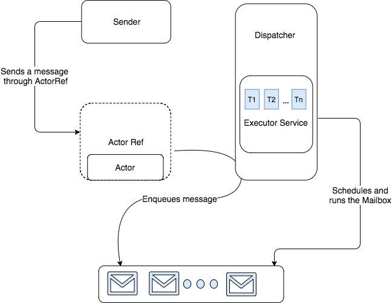

## Scala Shot
## <span style="color:#e49436">Akka Aktorzy</span>

Bartosz Budnik

---
@title[Model aktorów]
#### Model aktorów

- 1973 - Carl Hewitt, Peter Bishop, Richard Steiger.
- 1986 - firma Ericsson, pierwszy system oparty na aktorach 99,9999999%.
- Wprowadza abstrakcję pozwalającą skupić się na problemie podczas pisania wielowątkowych projektów. |
- Pozwala prosto pisać skalowalne, samo leczące się systemy. |

---
@title[Charakterystyka aktorów]
#### Charakterystyka aktorów
- Posiadają własny stan, zachowania, oraz skrzynkę pocztową. 
- Komunikują się pomiędzy sobą za pomoca niemutowalnych wiadomości. | 
- Aktorzy mogą zmieniać swoje zachowania oraz stan wewnętrzny. |
- Tworzą hierarchiczną strukturę. |

+++
@title[Przykład hierarchii]
#### Przykład hierarchii


---
@title[Prosty przykład...]
#### Prosty przykład...
```scala
object RepeaterActor {
  def props = Props[RepeaterActor]

  case class Say(message: String)
  case class SayHi()
  case class BeQuiet()
  case class SpeakAgain()
  case class NumberOfAnswers()
}

class RepeaterActor extends Actor {
  import context.become
  import context.unbecome

  private var requests: Int = 0

  override def receive: Receive = loud

  def loud: Receive = {
    case SayHi() => println("Hi!"); increment()
    case Say(message) => println(message); increment()
    case BeQuiet() => println("I will not speak again"); become(quiet);
    case NumberOfAnswers() => println(s"Nr of answers ${requests}")
    case _ =>
  }

  def quiet: Receive = {
    case SpeakAgain() => println("Lets talk again"); unbecome();
    case _ =>
  }

  def increment() = requests += 1
}
```

@[4-8](Deklaracja wiadomości.)
@[11-40](Klasa aktora.)
@[17](Zachowania aktora.)
@[19-26](Metoda przetwarzająca przychodzące wiadomości.)
@[22](Become zmieni zachowanie aktora na to zdefiniowane w funkcji quiet)
@[27-30](Przygodzące wiadomości będą obsługiwane za pomocą funkcji <i>quiet</i>.)
@[28](Unbecome zdejmie ze stosu zachowanie.)

+++
@title[... oraz jego wywołanie]
#### ... oraz jego wywołanie

```scala
object Repeater extends App {
  val system = ActorSystem("RepeaterSystem")

  val actorRef: ActorRef = system.actorOf(RepeaterActor.props, "repeater")

  actorRef tell RepeaterActor.SayHi()
  actorRef tell RepeaterActor.Say("ugabuga")

  actorRef tell RepeaterActor.BeQuiet()
  actorRef tell RepeaterActor.SayHi()
  actorRef tell RepeaterActor.Say("ugabuga")

  system.terminate()
}
```

@[2](Niezbędne jest stworzenie systemu aktorów.)
@[4](Dopiero wtedy będziemy mogli zainstancjonowac nowego aktora.)
@[6-11](Komunikacja z aktorem.)

---
@title[Jak to wszystko działa?]
#### Jak to wszystko działa?



---
@title[Komunikacja z aktorami]
#### Jak się z nimi komunikować?

```scala
//pattern tell
actor.tell(Say("ugabuga"))

//pattern ask
implicit val timeout: Timeout = Timeout(2.seconds)
val future: Future[String] = actor.ask(SayHi()).mapTo[String]
```

@[1-2](Wysyłanie wiadomości w stylu <i>fire and forget</i>. Zalecany sposób komunikacji z aktorami.)
@[4-6](Wysłanie wiadomość z oczekiwaniem na odpowiedź. Ma swoje wady.)

---
@title[Użycie paternu ask]
#### Użycie paternu ask

```scala
class DetailsManager(actor1: ActorRef) extends Actor {
  import context.dispatcher

  implicit val timeout = Timeout(4.seconds)

  override def receive: Receive = {
    case GetDetails() =>
      val future1 = ask(actor1, Factorial(1)).mapTo[BigDecimal]
      val future2 = ask(actor1, Factorial(5)).mapTo[BigDecimal]
      val future3 = ask(actor1, Factorial(10)).mapTo[BigDecimal]
      val future4 = ask(actor1, Factorial(1000)).mapTo[BigDecimal]

      val result = future1.flatMap(v1 => {
        future2 flatMap { v2 =>
          future3 flatMap { v3 =>
            future4 map { v4 =>
              (v1, v2, v3, v4)
            }
          }
        }
      })
      result pipeTo sender()

    case _ =>
  }
}
```

---
@title[Cameo patern]
#### Cameo pattern
```scala
class DetailsManager(actor1: ActorRef, actor2: ActorRef) extends Actor {
  override def receive: Receive = {
    case GetDetails() =>
      val handler = context.actorOf(DetailsHandler.props(sender()))
      actor1 tell(Factorial(100000000), handler)
      actor2 tell(RandomVal(2000), handler)
    case _ =>
  }
}

class DetailsHandler(val originalSender: ActorRef) extends Actor {
  import context.dispatcher

  val cancellable = context.system.scheduler.scheduleOnce(10.seconds, self, "timeout")

  var factorial: Option[BigDecimal] = None
  var randomNumber: Option[Long] = None

  override def receive: Receive = {
    case FactorialResult(res) =>
      factorial = Some(res)
      check()
    case RandomResult(res) =>
      randomNumber = Some(res)
      check()
    case "timeout" =>
      sendResponseAndShutdown(Failure(new Exception("timeout occured")))
  }

  def check() = (factorial, randomNumber) match {
    case (Some(fac), Some(rand)) =>
      sendResponseAndShutdown(DetailsResult(fac, rand))
    case _ =>
  }

  def sendResponseAndShutdown(resp: Any) = {
    cancellable.cancel()
    originalSender ! resp
    context.stop(self)
  }

}
```

@[1-9](Zadaniem DetailsManager jest zebranie wszystkich niezbędnych danych z róznych serwisów.)
@[4](Manager tworzy dziecko, którego jedynym zadaniem będzie odebranie wszystkich niezbędnych danych.)
@[5-6](Do aktorów wysyłamy wiadomości z żądaniami obliczeń i ustawiamy DetailsHandera jako nadawcę.)
@[11](Poprzez konstruktor zapisujemy orginalnego nadawcę żądania do którego przekażemy rezultaty.)
@[16-17](Rezultaty będą zapisywane jako stan aktora.)
@[20-25](Przy każdej nowej wiadomości sprawdzony zostanie stan aktora.)
@[30-34](Sprawdzenie czy rezultaty zostały dostarczone.)
@[36-40](Wysyłanie wiadomości i zamykanie aktora.)

---
@title[Wyjątki]
#### Wyjątki

- Niszczą aktualnie przetwarzaną wiadomość. 
- Wystąpienie wyjątku nie niszczy skrzynki aktora. |
- Uruchamiany zostaje proces "supervisora", który decyduje co się stanie z aktorem. |

+++
@title[Przykładowy supervisor]

```scala
override val supervisorStrategy =
  OneForOneStrategy(maxNrOfRetries = 10, withinTimeRange = 1 minute) {
    case _: ArithmeticException      ⇒ Resume
    case _: NullPointerException     ⇒ Restart
    case _: IllegalArgumentException ⇒ Stop
    case _: Exception                ⇒ Escalate
  }
```

---
@title[Podsumowanie]
## Podsumowanie

---
@title[Więcej informacji]
#### Więcej informacji

- <a href="https://akka.io/docs/">Dokumentacja</a> dokumentacjia biblioteki Akka.
- Książka <a href="https://www.manning.com/books/akka-in-action">Akka in Action</a>.
- Książka <a href="http://shop.oreilly.com/product/0636920028789.do">Effective Akka</a> - skupia się na dobrych wzorcach. 

---
@title[Koniec]
## Koniec
## <span style="color:#e49436">Dziekuję za uwagę</span>
